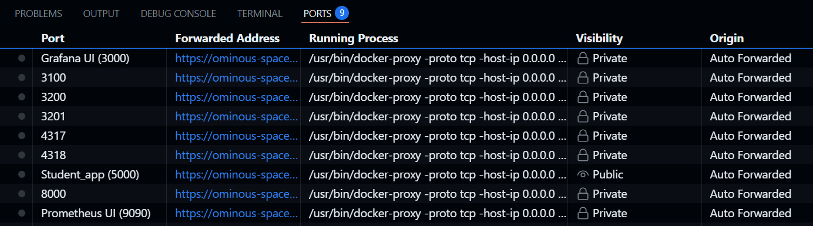

# OTEL Auto-Instrumented Demo

**OTEL Auto-Instrumented Demo** — a beginner-friendly project showcasing **automatic instrumentation using OpenTelemetry** for a Python-based student application. This project runs in a **Dockerized environment** and can be easily managed using a `Makefile`.

---

## 🚀 Getting Started

### Prerequisites

To get started, you’ll need:

- GitHub Codespaces enabled *(or Docker & Make installed locally)*  

---

## ⚙️ Setup & Run

### 1. Launch in GitHub Codespaces

Open this repository in **GitHub Codespaces** for a quick and hassle-free setup.

---

### 2. Start the Application

To start the full stack including the student app, Grafana, Prometheus, and Loki, run:

```bash
make start
``` 
This command will:

- Create a loki/ folder for logs

- Launch all required services using `docker-compose`

---
###  3. Available Services After Startup


Once running, the following services will be available:

- Grafana UI – for visualization

- Prometheus UI – for metrics

- Student App API – where you can send test requests
---

###  4. Explore the metrics, logs and Traces


Once running, the following services will be available:

- Grafana UI – Metrics


- Grafana UI – Logs


- Grafana UI – Traces

---

### 5. Stop the Application
To stop and clean up the demo environment, run:
```make
make stop
```
This will stop and remove all Docker containers and olumes started by the demo.


